

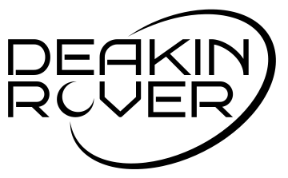

# Deakin Rover — Australian Rover Challenge 2026

**A student-built, ROS2-powered lunar rover competing at the Australian Rover Challenge 2026.**

<!--  -->

---

*Deakin Rover doing the construction task (Image Source: [ARCh 2026 Day 3 Livestream](https://www.youtube.com/live/MWcUxFiwad8?si=puMAp9pC9WCaEeoM&t=7673))*

---

## Table of Contents

- [Project Overview](#-project-overview)
- [System Architecture](#-system-architecture)
- [Features](#-features)
- [Awards & Recognition](#-awards--recognition)
- [Getting Started](#-getting-started)
- [Team & Acknowledgements](#-team--acknowledgements)
- [License](#-license)

---

## 🚀 Project Overview

The Deakin Rover is designed and built by the [Deakin Competitive Robotics Club](https://www.instagram.com/deakinrobotics) for the **[Australian Rover Challenge (ARC)](https://www.australianroverchallenge.com.au/)**, Australia's premier university rover competition. Teams design, build, and operate rovers through a series of field tasks including terrain traversal, equipment servicing, autonomous navigation, and science sample retrieval.

This repository contains the full software stack of Deakin Rover Borealis for the 2026 competition entry: onboard Jetson Nano software, base station ROS2 workspace, and the web-based operator dashboard built with Next.js — all containerised with Docker.

---

## 🏗 System Architecture

The rover runs a self-contained ROS2 stack on an NVIDIA Jetson Nano. The operator connects via a Next.js web GUI over Wi-Fi with no ROS2 installation required on the operator's PC.

> **Note on `dcr_base_station/base_station_ws/` and `dcr_base_station/.devcontainer/`:** These exist solely for local development and GUI testing. They allow a developer without access to the physical rover to spin up an Ubuntu + ROS2 Jazzy container running the same nodes as the Jetson, so the GUI can be validated end-to-end on a laptop. They are **not** part of the competition architecture and are **not** deployed on-site.

**Rover (NVIDIA Jetson Nano — `dcr_rover/`):**

*Drivetrain:*
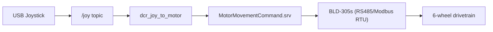

*Robotic Arm:*
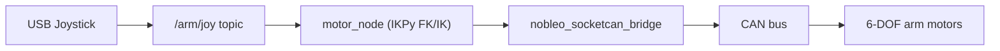

*Camera Streaming:*
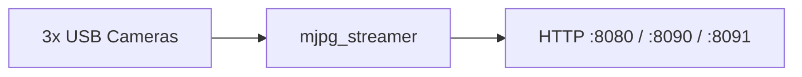

*Antenna and LEDs:*
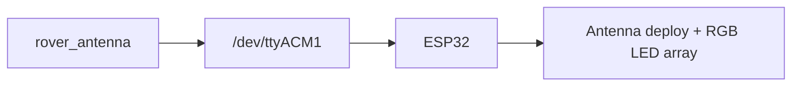

*Operator Comms:*
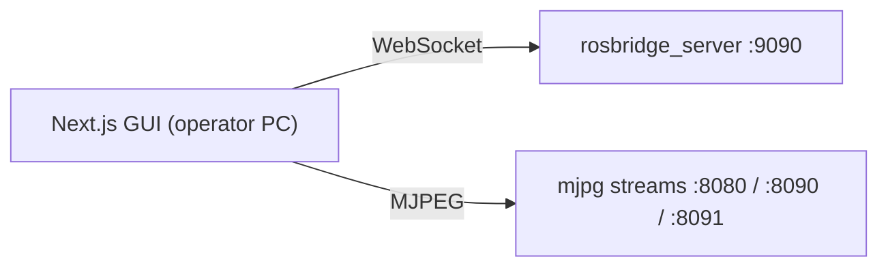

> **Development tool — Foxglove Studio + `foxglove_bridge` (:8765):** During development and field testing, Foxglove Studio connected to the rover via `foxglove_bridge` to visualise the robotic arm URDF in real time, giving the team a live digital twin of the arm. This was used to verify joint positions and ensure no arm segment was colliding with the chassis or other parts of the rover during operation. Foxglove is **not** required to run the system in competition.

**Operator PC (`dcr_base_station/gui/` only):**

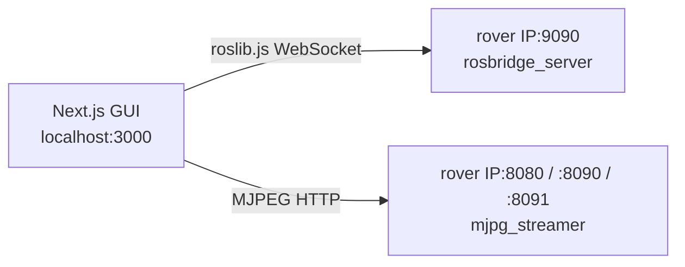

The Jetson Docker container (`dustynv/ros:jazzy-desktop-r36.4.0-cu128-24.04`, CUDA 12.8-optimised) is the only containerised ROS2 environment used in competition.

---

## ✨ Features

### Software

| Feature | Details |
|---------|---------|
| **ROS2 Jazzy middleware** | rosbridge WebSocket server (:9090) for GUI communication |
| **Full Docker containerisation** | Dev containers for both Jetson and operator PC; reproducible builds with zero host dependency conflicts |
| **Operator dashboard** | Next.js 16 / React 19 / MUI 7 web GUI — camera feeds, arm control, antenna/LED panel, joystick status |
| **Joystick teleoperation** | USB gamepad → `/joy` → `dcr_joy_to_motor` at 3 Hz with 500 ms watchdog timeout |
| **6-DOF arm kinematics** | `motor_node` implements forward & inverse kinematics via [IKPy](https://github.com/Phylliade/ikpy) from a URDF model |
| **Multi-camera streaming** | 3× USB cameras (640×480, 15 fps, MJPEG) via `mjpg_streamer` on ports 8080/8090/8091 |
| **Deployable antenna** | Custom deployment code + ESP32 firmware; RGB LED control via serial at 115200 baud |
| **SocketCAN bridge** | `nobleo_socketcan_bridge` (C++20) at 1 Mbps — exposes CAN bus as `/socketcan_bridge/rx` and `/socketcan_bridge/tx` ROS2 topics |
| **Custom ROS2 interfaces** | `dcr_interfaces` (motor commands, LED commands), `arm_interfaces` (motor move/status messages) |

### Hardware

| Subsystem | Details |
|-----------|---------|
| **6-wheel drivetrain** | BLD-305s brushless motor controllers via RS485/Modbus RTU; up to 3500 RPM; address-based direction control |
| **6-DOF robotic arm** | CAN-bus actuated; position control and speed control modes; laser-equipped end effector |
| **Multi-camera rig** | 3× USB cameras |
| **Deployable antenna** | ESP32-controlled deployment mechanism with addressable RGB LED array |

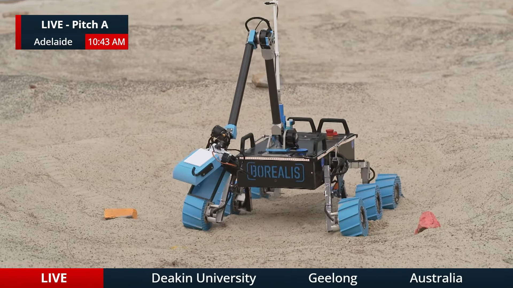
*6-DOF robotic arm picking rocks during the construction task (Image Source: [ARCh 2026 Day 3 Livestream](https://www.youtube.com/live/MWcUxFiwad8?si=kfXTude7WFz8H4h-&t=7972).)*

<!-- 
*Deployable antenna extended with ESP32-controlled LED array active.* -->

---

## 🏆 Awards & Recognition

### Australian Rover Challenge 2026

| Award | Category |
|-------|----------|
| **Best Team Culture** | Team Culture |

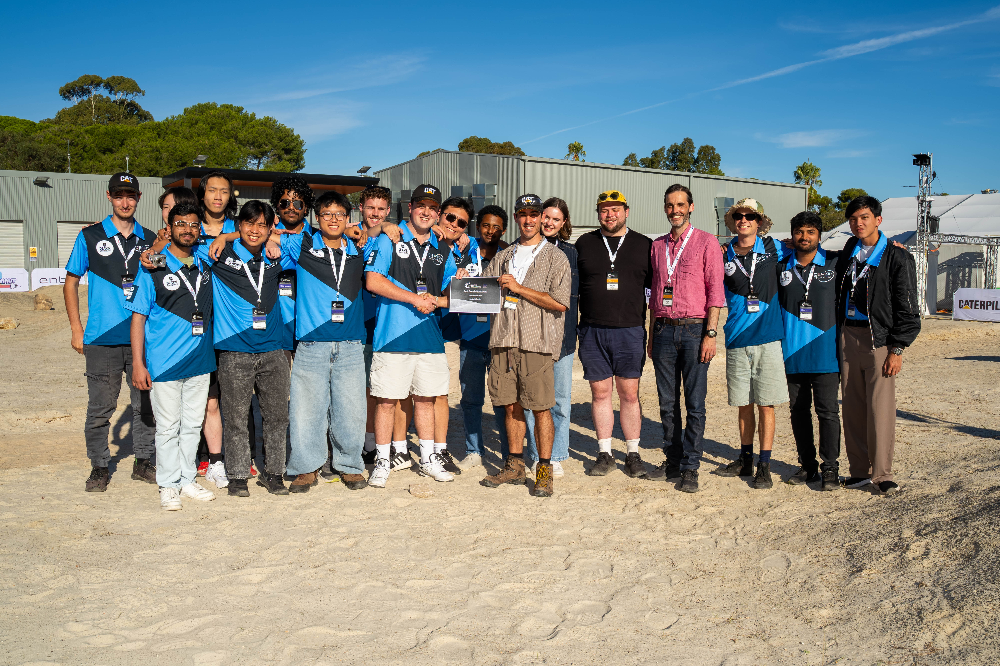
*Team Deakin receiving the Best Team Culture Award at the Australian Rover Challenge 2026. (Watch on Livestream: [Link](https://www.youtube.com/live/HbswUp7gHko?si=Jf3o1DR52gmgUhfn&t=31085))*

---

## 🛠 Getting Started

Setup involves several prerequisite steps — installing the PEAK CAN driver, patching the Linux kernel for multi-camera USB support, connecting and configuring cameras, installing Docker, VS Code, and the Dev Containers extension — before the ROS2 workspace can be built and launched.

<!-- Full step-by-step instructions are in the documentation:

**[📖 Read the full setup guide](https://deakin-rover.readthedocs.io/en/latest/getting-started/)** -->

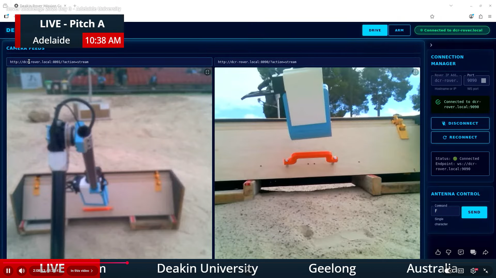
*Operator dashboard: live camera feeds, arm control panel, antenna control, and joystick status. (Image Source: [ARCh 2026 Day 3 Livestream](https://www.youtube.com/live/MWcUxFiwad8?si=IVAMN0q7_z7-uqs-&t=7971).)*

---

## 👥 Team & Acknowledgements

### Team Deakin — ARC 2026

| Member | GitHub / LinkedIn | Title | Contribution |
|--------|-------------------|-------|--------------|
| Arden Drew Cunneen |  | Team Leader & Project Manager | Managed the project end-to-end; sourced funding; enforced systems engineering process; organised all logistics, travel, and accommodation for Adelaide |
| Misbah Ali |   | Software & Autonomous Systems Lead | ROS2 architecture design, Docker containerisation, teleoperation pipeline, GUI development |
| Ayan |   | Software Team | GUI development |
| Atharva |   | Software Team | GUI development |
| Bon |   | Payloads Team Lead | Led the development of Robotic Arm, Robotic arm forward & inverse kinematics implementation and ROS2 code |
| Ryan Falconer |  | Payloads Team Member | Designed, manufactured, and assembled the robotic arm together with Bon |
| Gregorius Nathaniel Perdana Budihartono |  | Payloads Team Member | Designed and programmed the end effector; designed the construction-task scooper; arm electronics; 3D-printed motor housing and mechanical parts |
| Simeon Chun Kit Choo |  | Payloads Team Member | Robotic arm design and development; wire management and soldering; chassis panels and Borealis front plate design and manufacturing; designed the rover carry frame |
| Seth Belleville |  | Payloads Team Member | Designed construction-task pavers; major contributor to Best Team Culture Award |
| Nguyen |   | Cameras & Communication Team Lead | Antenna deployment code and ESP32 firmware for antenna control |
| Tuan |   | Cameras & Communication Co-lead | Antenna deployment code and ESP32 firmware for antenna control |
| Zachary Michael Dwyer |  | Cameras & Communication Team Member | Camera placement and testing; electrical organisation and wire management; parts sourcing; assisted with antenna installation, wireless networking, and IP configuration |
| Truong Gia Bao Ly |  | Cameras & Communication Team Member | Camera and communication subsystem; LED installation; electrical wire management; provided car and drove the team to/from Adelaide and the competition site |
| Biniam Seyoum Getachew |  | Cameras & Communication Team Member | Camera and communication subsystem; CAD design for camera mounts; electrical wire management |
| Nathan |   | Electrical Team Lead | Full electrical architecture (2025 base), drivetrain motor control, Linux kernel patch for multi-camera support, mjpg-streamer integration |
| Zack Harvey |  | General Support | Spray-painted rover chassis; laser-cutting and manufacturing support; club executive support for funding and club activities |

### Acknowledgements

#### 2025 Foundations

- **Lachlan Carboon**  — co-founded the [Deakin Competitive Robotics Club](https://www.instagram.com/deakinrobotics) and started the rover project at Deakin University. He signed the team up for the Australian Rover Challenge, introduced it to Deakin students, built the first team, and submitted the first competition documents in 2025 — without him, none of this exists.
- **Matt Davison**  — designed the original rover from the ground up in 2025, enabling Deakin's first-ever entry at the Australian Rover Challenge. The full mechanical design — chassis, suspension, and wheels — was his work, and the 2026 build is built directly on top of it.
- **Jatan Vadgama**  *(Mechanical Team Lead, ARC 2025)* — took Matt's design, made key modifications, and assembled the complete rover for the 2025 competition. His mechanical engineering and creativity were instrumental in the 2025 build cycle. The 2026 team used the chassis and suspension he assembled and redesigned only the wheels.
- **Nathan**  — the drivetrain motor control system is built on top of the electrical design and codebase Nathan developed for the 2025 competition. His work on RS485 motor interfacing and the Linux kernel patch for multi-camera USB support laid the foundation for this year's software.

#### Open Source

- **[mjpg-streamer](https://github.com/jacksonliam/mjpg-streamer)** — open source MJPEG streaming used for all three camera feeds.
- **[nobleo/nobleo_socketcan_bridge](https://github.com/nobleo/nobleo_socketcan_bridge)** — C++20 SocketCAN ↔ ROS2 bridge used for CAN bus communication with arm motors.

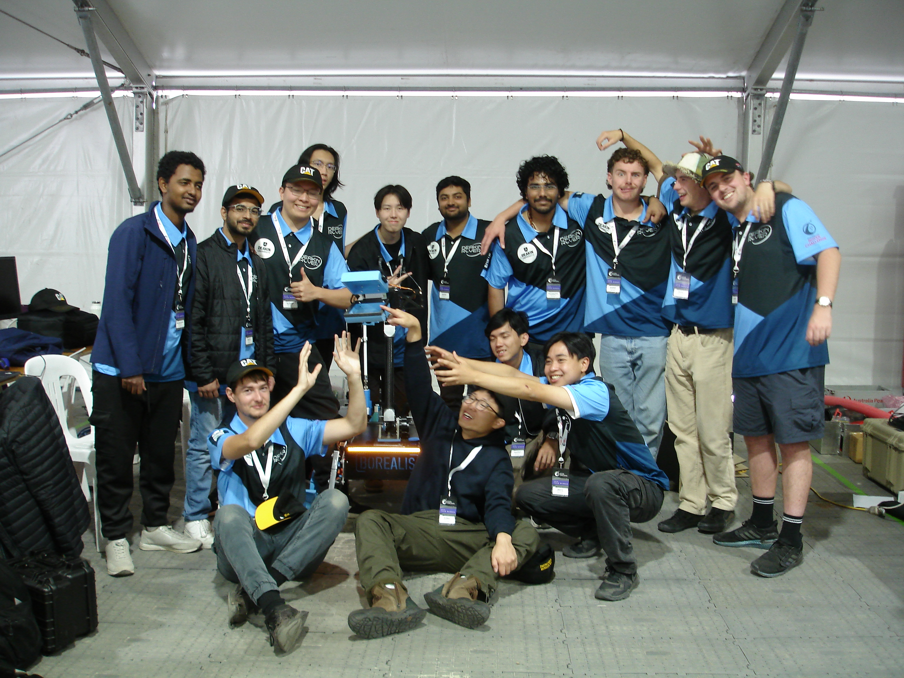
*Team Deakin at the Australian Rover Challenge 2026.*

---

<!-- ## 📚 Resources

| Resource | Link |
|----------|------|
| Full documentation | [deakin-rover.readthedocs.io](https://deakin-rover.readthedocs.io) *(coming soon)* |
| Demo video | [YouTube — Deakin Rover ARC 2026](https://youtube.com) *(coming soon)* |
| Competition results | [ARC 2026 Results](https://www.australianroverchallenge.com.au/) *(coming soon)* |

--- -->

## 📄 License

This project is licensed under the **Apache License 2.0** — see the [LICENSE](LICENSE) file for details.
